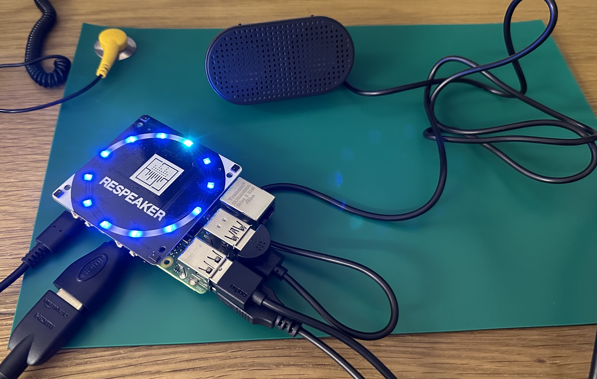

# ChatGPT Smart Speaker (speech recognition and text-to-speech using OpenAI and gTTS)



## The chat.py script

The `chat.py` script allows you to use speech recognition to input a prompt, send the prompt to OpenAI to generate a response, and then use gTTS to convert the response to an audio file and play the audio file on your Mac/PC. Your PC/Mac must have a working default microphone and speakers for this script to work. Please note that this script was designed on a Mac, so additional dependencies may be required on Windows and Linux. 

## The smart_speaker.py script

The `smart_speaker.py` script is currently work in progress to implement the same functionality on a Raspberry Pi. Please read the important notes in the section below and ensure that you have the `smart_speaker.py` script along with `apa102.py` and `alexa_led_pattern.py` scripts in the same folder together on your Pi. You will need to have a speaker and microphone attached to your Raspberry Pi. I used both a USB microphone and USB speaker. Ensure that these are setup correctly. You can test that the speaker and microphone are set up correctly as the default devices by using a software program such as Audacity. Audacity is buggy on startup but still works on a Raspberry Pi (see instructions in the important notes section below).

## Prerequisites - chat.py

- You need to have a valid OpenAI API key. You can sign up for a free API key at https://beta.openai.com/.
- You need to install the following packages: `openai`, `gTTS`, `pyaudio`, `SpeechRecognition`, `playsound, python-dotenv`. You can install these packages using `pip install openai gTTS pyaudio SpeechRecognition playsound python-dotenv` or use pipenv if you wish to contain a virtual environment.

## Prerequisites - smart_speaker.py
- You'll need to follow the instructions above, plus run the following on your Raspberry Pi terminal:

1. `sudo apt update`

2. `sudo apt install python3-gpiozero`

- To run smart_speaker.py you will need a Raspberry Pi 4b (I'm using the 4GB model but 2GB should be enough), ReSpeaker 4-Mic Array for Raspberry Pi and USB speakers.

## Usage - applies to chat.py:

1. You'll need to set up the environment variable for your Open API Key: `openai.api_key = "OPENAI_API_KEY"`. To do this create a `.env` file in the same directory and add your API Key to the file like this: `OPENAI_API_KEY = "API KEY GOES HERE"`. This is safer than hard coding your API key into the program.
2. Run the script using `python chat.py`.
3. The script will prompt you to say something. Speak a sentence into your microphone. You may need to allow the program permission to access your microphone on a Mac, a prompt should appear when running the program.
4. The script will send the spoken sentence to OpenAI, generate a response using the text-to-speech model, and play the response as an audio file.

## Usage - applies to smart_speaker.py:
1. Ensure that you have the `smart_speaker.py` script along with `apa102.py` and `alexa_led_pattern.py` scripts in the same folder saved on your Pi.
2. Run the script using `python smart_speaker.py`.
3. The script will prompt you to say the wake word which is programmed into the file `smart_speaker.py` as 'Lily'. You can change this to any name you want but always include an upper and lower case version of the name for better detection. Once the wake word has been detected the lights will light up blue. It will now be ready for you to ask your question. When you have asked your question, or when the microphone picks up and processes noise, the lights will rotate a blue colour meaning that your recording sample is being sent to OpenAI.
4. The script will then generate a response using the text-to-speech model, and play the response as an audio file.


## Customisation

- You can change the OpenAI model engine by modifying the value of `model_engine`. For example, to use the "davinci" engine, set `model_engine = "davinci"`.
- You can change the language of the generated audio file by modifying the value of `language`. For example, to generate audio in French, set `language = 'fr'`.
- You can adjust the `temperature` parameter in the following line to control the randomness of the generated response:

```
response = openai.Completion.create(
engine=model_engine,
prompt=prompt,
max_tokens=1024,
n=1,
temperature=0.7,
)
```

Higher values of `temperature` will result in more diverse and random responses, while lower values will result in more deterministic responses.

## Important notes for Raspberry Pi Installation

If you want to use ReSpeaker for the lights, you can purchase this from most of the major online stores that stock Raspberry Pi. 
Here is the online guide: https://wiki.seeedstudio.com/ReSpeaker_4_Mic_Array_for_Raspberry_Pi/

To test your microphone and speakers install Audacity on your Raspberry Pi:

`sudo apt update`

`sudo apt install audacity`

`audacity`

On the raspberry pi you may encounter an error regarding the installation of `flac`.

See here for the resolution: https://raspberrypi.stackexchange.com/questions/137630/im-unable-to-install-flac-on-my-raspberry-pi-3
 
`$ wget https://archive.raspbian.org/raspbian/pool/main/libo/libogg/libogg0_1.3.2-1+b2_armhf.deb`

`$ wget https://archive.raspbian.org/raspbian/pool/main/f/flac/libflac8_1.3.2-2+deb9u2_armhf.deb`

`$ wget https://archive.raspbian.org/raspbian/pool/main/f/flac/flac_1.3.2-2+deb9u2_armhf.deb`

`$ sudo dpkg -i libogg0_1.3.2-1+b2_armhf.deb`

`$ sudo dpkg -i libflac8_1.3.2-2+deb9u2_armhf.deb` 

`$ sudo dpkg -i flac_1.3.2-2+deb9u2_armhf.deb`

`$ which flac`
`/usr/bin/flac`

`$ flac --version`
`flac 1.3.2`

## Credit to:
https://github.com/tinue/apa102-pi & Seeed Technology Limited for supplementary code.